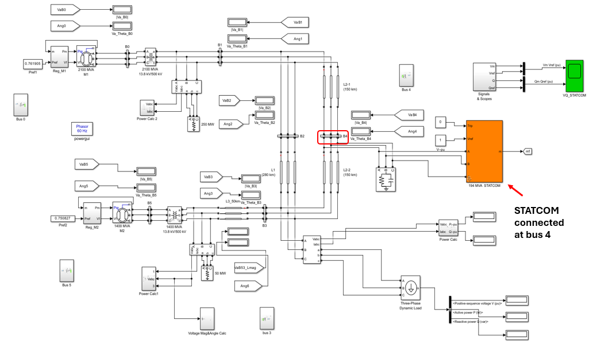
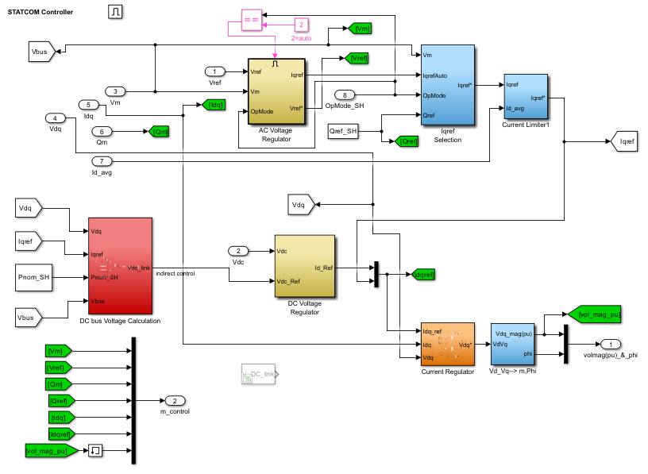
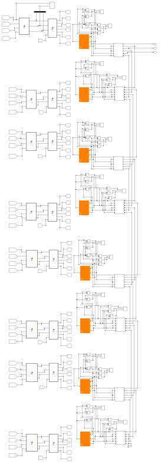
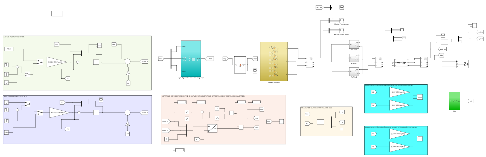
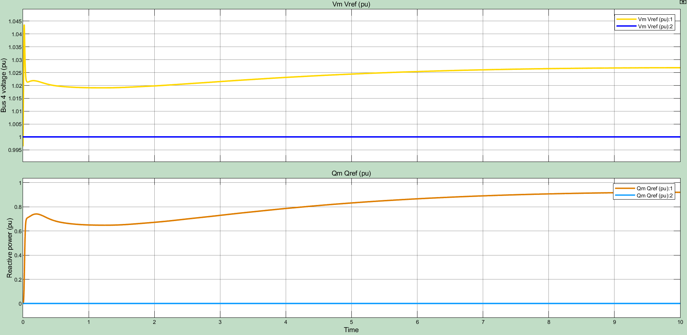
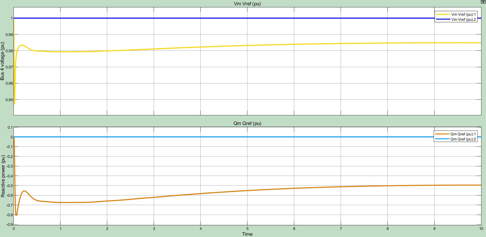
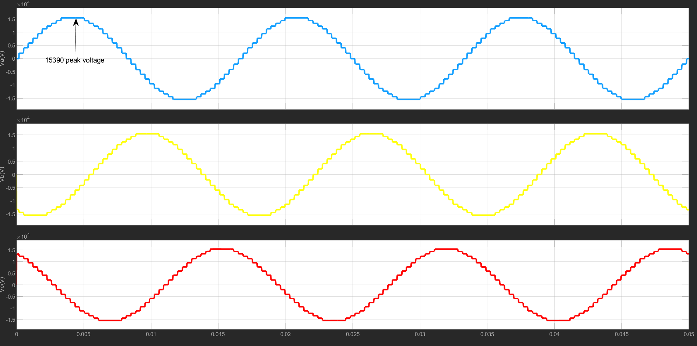

# Modeling and Simulation of FACTS Devices for Power Quality Enhancement

## Overview
This project investigates the application of Flexible AC Transmission Systems (FACTS) devices to improve power quality and overall performance of electrical power systems.

## Objective
To evaluate how FACTS devices provide fast dynamic compensation and enhance system stability under different operating conditions.

---

## Modeling Approaches

### Dynamic Modeling
- Implemented a detailed 48-pulse, three-level multipulse GTO-based converter  
- Designed associated control structure for transient analysis  
- Captured fast dynamic response of FACTS devices  

### Phasor Average Modeling
- Used simplified algebraic equations  
- Focused on steady-state system performance  
- Suitable for large-scale system studies  

---

## Simulation Models and System Design

### Power System with STATCOM

Grid-connected power system with a STATCOM installed at Bus 4 to provide reactive power support and improve voltage stability.

---

### STATCOM Control Structure

Control system used to regulate reactive power and maintain bus voltage through dq-axis current control.

---

## Converter Design

### 48-Pulse Converter Configuration

Topology of the 48-pulse converter formed by combining multiple 6-pulse converters to achieve improved harmonic performance.

---

### Complete Converter System Model

Full Simulink implementation of the grid-connected converter system used for dynamic analysis.

---

## Simulation Results

### Capacitive Load Condition

Demonstrates the effect of a capacitive load on bus voltage and STATCOM reactive power response.

---

### Inductive Load Condition

Shows system behavior under inductive loading, highlighting the STATCOM’s ability to regulate voltage.

---

### Converter Output Voltage

Three-phase output voltage of the 48-pulse converter demonstrating high-quality waveform generation.

---

## Tools Used
- MATLAB  
- Simulink  

---

## Key Results & Conclusions

- Identified Bus 4 as the weakest node in voltage regulation, requiring reactive power compensation to maintain stability within the 0.97–1.03 p.u. range  

- Closed-loop control of the converter achieved:
  - Improved reference tracking  
  - Reduced steady-state error  
  - Enhanced disturbance rejection  

- Achieved decoupled control:
  - Id regulates active power  
  - Iq regulates reactive power  

- STATCOM effectively regulated voltage using DC-link control  

- Phasor modeling reduced complexity while maintaining accuracy  

---

## Conclusion
This project demonstrates the effectiveness of FACTS devices, particularly STATCOM, in improving voltage stability and power quality, while highlighting the trade-offs between detailed dynamic modeling and simplified phasor approaches.

---

## Files
- FACTS_Power_Quality_Report.pdf  
- FACTS Power Quality Simulink models.zip  

---

## Author
Royalty Holyworth Chihava
